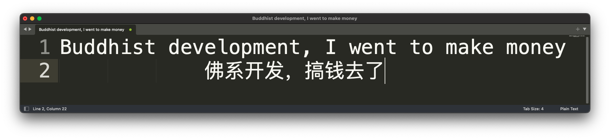

## Hi there 👋

<!--
**chauchy-Liu/chauchy-Liu** is a ✨ _special_ ✨ repository because its `README.md` (this file) appears on your GitHub profile.

Here are some ideas to get you started:

- 🔭 I’m currently working on ...
- 🌱 I’m currently learning ...
- 👯 I’m looking to collaborate on ...
- 🤔 I’m looking for help with ...
- 💬 Ask me about ...
- 📫 How to reach me: ...
- 😄 Pronouns: ...
- ⚡ Fun fact: ...
-->
<h3 align="center">
    Hi~ Thank you for coming!
    
</h3>


<!-- Typing SVG - https://github.com/DenverCoder1/readme-typing-svg -->
<!-- Typing SVG Fast Demo - https://readme-typing-svg.herokuapp.com/demo/ -->
<p align="center">
    
</p>

<p align="center">
    
    <!--  -->
    <a href="https://chauchy-liu.github.io" target="_blank"></a>
    

[comment]: <> ( if the badge is down, try this website https://vbr.wocr.tk/badge?page_id=chauchy-Liu&style=plastic&lcolor=590d22&logo=Github&hit=false but this page maybe have bug)
[//]: # (    )

</p>

<br/>

🎉 **Welcome to my GitHub profile!**

𝑯𝒊, 𝑰'𝒎 ✨ [Chauchy](https://chauchy-Liu.github.io) ✨ 🥷🏻 , 𝒂 𝒑𝒂𝒔𝒔𝒊𝒐𝒏𝒂𝒕𝒆 𝒔𝒆𝒍𝒇-𝒕𝒂𝒖𝒈𝒉𝒕 𝑭𝒖𝒍𝒍 𝑺𝒕𝒂𝒄𝒌 𝒘𝒆𝒃 𝒅𝒆𝒗𝒆𝒍𝒐𝒑𝒆𝒓 𝒂𝒏𝒅 𝒂 𝒇𝒖𝒏𝒏𝒚 𝒔𝒐𝒇𝒕𝒘𝒂𝒓𝒆 𝒆𝒏𝒈𝒊𝒏𝒆𝒆𝒓 𝒇𝒓𝒐𝒎 𝑪𝒉𝒊𝒏𝒂.  𝑰 𝒕𝒂𝒌𝒆 𝒈𝒓𝒆𝒂𝒕 𝒄𝒂𝒓𝒆 𝒊𝒏 𝒕𝒉𝒆 𝒂𝒓𝒄𝒉𝒊𝒕𝒆𝒄𝒕𝒖𝒓𝒆 𝒂𝒏𝒅 𝒄𝒐𝒅𝒆 𝒒𝒖𝒂𝒍𝒊𝒕𝒚 𝒐𝒇 𝒕𝒉𝒆 𝒕𝒉𝒊𝒏𝒈𝒔 𝑰 𝒃𝒖𝒊𝒍𝒅. 𝑰 𝒂𝒎 𝒂𝒍𝒔𝒐 𝒂𝒏 𝒐𝒑𝒆𝒏-𝒔𝒐𝒖𝒓𝒄𝒆 𝒆𝒏𝒕𝒉𝒖𝒔𝒊𝒂𝒔𝒕 𝒂𝒏𝒅 𝒎𝒂𝒊𝒏𝒕𝒂𝒊𝒏𝒆𝒓. 

<!-- code.gif -->


🛠️ **My Tech Stack and Tools:**

<p>
    <!-- <a href="https://github.com/search?q=user%3Apudongping+is%3Arepo+language%3Aphp"></a> -->
    <!-- <a href="https://github.com/search?q=user%3Apudongping+is%3Arepo+language%3AGolang"></a> -->
    <a href="https://github.com/search?q=user%3Apudongping+is%3Arepo+language%3Apython"></a>
    <a href="https://github.com/search?q=user%3Apudongping+is%3Arepo+language%3AShell"></a>
    <!-- <a href="https://github.com/search?q=user%3Apudongping+is%3Arepo+language%3Acss"></a> -->
    <!-- <a href="https://github.com/search?q=user%3Apudongping+is%3Arepo+language%3Ahtml"></a> -->
    <!-- <a href="https://github.com/search?q=user%3Apudongping+is%3Arepo+language%3Ajavascript"></a> -->
    <!-- <a href="https://github.com/search?q=user%3Apudongping+is%3Arepo+language%3Ajavascript"></a> -->
</p>

<p>
    <a href="#"></a>
    <!-- <a href="https://github.com/search?q=user%3Apudongping+is%3Arepo+language%3Avue"></a> -->
    <!-- <a href="https://github.com/search?q=user%3Apudongping+is%3Arepo+language%3ABootstrap"></a> -->
    <!-- <a href="#"></a> -->
    <a href="#"></a>
    <a href="#"></a>
    <a href="#"></a>
    <a href="#"></a>
    <!-- <a href="#"></a> -->
    <!-- <a href="#"></a> -->
    <!-- <a href="#"></a> -->
    <!-- <a href="#"></a> -->
    <!-- <a href="#"></a> -->
</p>

<p>
    
    <!--  -->
</p>

<p>
    
</p>

<p>
    <a href="#"></a>
    <!-- <a href="#"></a> -->
    <a href="#"></a>
    <a href="#"></a>
    <!-- <a href="#"></a> -->
    <a href="#"></a>
    <a href="https://github.com/search?q=user%3Apudongping+is%3Arepo+language%3Asql"></a>
</p>

<p>
    <a href="#"></a>
    <!-- <a href="#"></a> -->
    <a href="#"></a>
    <a href="#"></a>
    <!-- <a href="#"></a> -->
</p>

<p>
    <a href="#"></a>
    <a href="#"></a>
    <a href="#"></a>
    <!-- <a href="#"></a> -->
    <a href="#"></a>
    <a href="#"></a>
</p>

<p>
    <a href="#"></a>
    <a href="#"></a>
    <a href="#"></a>
    <a href="https://github.com/search?q=user%3Apudongping+is%3Arepo+language%3Amarkdown"></a>
    <a href="#"></a>
    <a href="#"></a>
    <a href="#"></a>
    <a href="#"></a>
    <a href="#"></a>
    <a href="#"></a>
    <a href="#"></a>
    <a href="#"></a>
    <a href="#"></a>
    <!-- <a href="#"></a> -->
    <!-- <a href="#"></a> -->
    <!-- <a href="#"></a> -->
    <!-- <a href="#"></a> -->
</p>

欢迎 pick 👇

📄 [个人网站](https://chauchy-liu.github.io/)  ｜ 📞 18560121924 ｜ 📮 liuchuanxi_211@163.com

<!-- waka readme - https://github.com/athul/waka-readme -->
📊 **This Week I Spent My Time On:**
<!--START_SECTION:waka-->


**我是早起的 🐤** 

```text
🌞 早晨                     63 commits          ████░░░░░░░░░░░░░░░░░░░░░   15.40 % 
🌆 白天                     167 commits         ██████████░░░░░░░░░░░░░░░   40.83 % 
🌃 傍晚                     179 commits         ███████████░░░░░░░░░░░░░░   43.77 % 
🌙 晚上                     0 commits           ░░░░░░░░░░░░░░░░░░░░░░░░░   00.00 % 
```
📅 **我最有效率是在 星期五** 

```text
星期一                      10 commits          █░░░░░░░░░░░░░░░░░░░░░░░░   02.44 % 
星期二                      21 commits          █░░░░░░░░░░░░░░░░░░░░░░░░   05.13 % 
星期三                      17 commits          █░░░░░░░░░░░░░░░░░░░░░░░░   04.16 % 
星期四                      158 commits         ██████████░░░░░░░░░░░░░░░   38.63 % 
星期五                      192 commits         ████████████░░░░░░░░░░░░░   46.94 % 
星期六                      6 commits           ░░░░░░░░░░░░░░░░░░░░░░░░░   01.47 % 
星期日                      5 commits           ░░░░░░░░░░░░░░░░░░░░░░░░░   01.22 % 
```


📊 **本周消耗时间** 

```text
🕑︎ 时区: Asia/Shanghai

💬 编程语言: 
C++                      6 hrs 35 mins       ███████████░░░░░░░░░░░░░░   43.44 % 
Python                   4 hrs 17 mins       ███████░░░░░░░░░░░░░░░░░░   28.28 % 
CMake                    3 hrs 12 mins       █████░░░░░░░░░░░░░░░░░░░░   21.11 % 
C                        50 mins             █░░░░░░░░░░░░░░░░░░░░░░░░   05.51 % 
JSON                     4 mins              ░░░░░░░░░░░░░░░░░░░░░░░░░   00.53 % 

🔥 编辑器: 
VS Code                  15 hrs 10 mins      █████████████████████████   100.00 % 

🐱‍💻 项目: 
Qt-project               10 hrs 53 mins      ██████████████████░░░░░░░   71.72 % 
wind-efficient-new       4 hrs 17 mins       ███████░░░░░░░░░░░░░░░░░░   28.28 % 

💻 操作系统: 
Mac                      15 hrs 10 mins      █████████████████████████   100.00 % 
```

**我最常使用 C++** 

```text
C++                      2 repos             ██████████░░░░░░░░░░░░░░░   40.00 % 
TypeScript               1 repo              █████░░░░░░░░░░░░░░░░░░░░   20.00 % 
HTML                     1 repo              █████░░░░░░░░░░░░░░░░░░░░   20.00 % 
Python                   1 repo              █████░░░░░░░░░░░░░░░░░░░░   20.00 % 
```


 Last Updated on 19/05/2025 01:09:47 UTC
<!--END_SECTION:waka-->
<br/>

---



---

<br/>


---

<details>
  <summary><b>Things used in this README</b></summary>
  <br>
  <ol>
    <li>
        <a href="https://github.com/DenverCoder1/readme-typing-svg">Typing SVG</a>
    </li>
    <li>
        <a href="https://www.dute.org/weird-fonts">怪异英文生成器</a>
    </li>
    <li>
      <a href="https://github.com/Nathan13888/VisitorBadgeReloaded">Visitor Badge Reloaded</a>
    </li>
    <li>
      <a href="https://github.com/lowlighter/metrics">Lowlighter's Metrics</a>
    </li>
    <li>
      <a href="https://github.com/athul/waka-readme">waka-readme</a>
    </li>
    <li>
      <a href="https://github.com/anuraghazra/github-readme-stats">github-readme-stats</a>
    </li>
    <li>
        <a href="https://github.com/ashutosh00710/github-readme-activity-graph">github-readme-activity-graph</a>
    </li>
    <li>
        <a href="https://shields.io">Shields.io</a>
    </li>
    <li>
        <a href="https://hits.dwyl.com/">HITS</a>
    </li>
  </ol>
</details>
